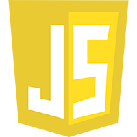
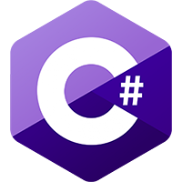
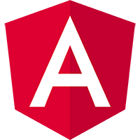
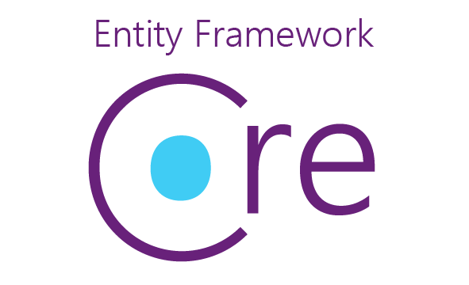

# Hi, I'm Khoa

#### An experienced .NET engineer with 3 years of experience in .Net and Angular. Good expertise with Sharepoint and SQL database. Also familiar with Saas architecture on Azure Cloud

<!--  -->

<!--  -->

## Techonologies:

    
    
    
    
    
    
    
    
    
    
    
    
    
    
    
    
    
    
    
    
    
    
    
    
    
    
    
    
    
    
    
    
    
    
    

