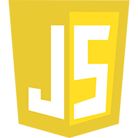
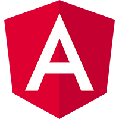
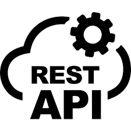
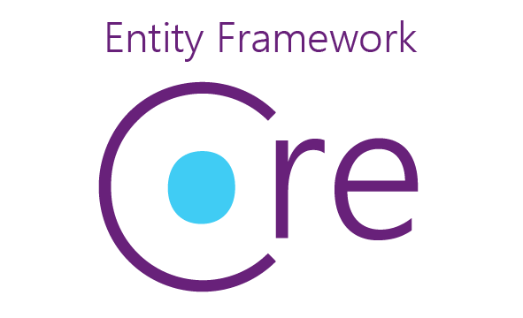
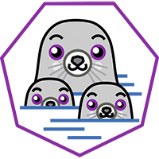
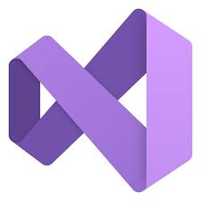

# Le Minh Khoa

Backend-focused software developer working across the .NET / ABP Framework ecosystem, with hands-on experience in full-stack web development, databases, and DevOps.

## About me

- 🛠️ Building and maintaining backend services with C#, ABP Framework, EF Core and Dapper
- 🌐 Comfortable across the stack — Angular / React on the frontend, PostgreSQL / SQL Server / MongoDB / Redis on the data side
- ☁️ Shipping with Docker, Azure and Azure DevOps
- 🧩 Sharpening problem-solving on LeetCode

## Connect with me

## Stats
<!-- comment because api is unavailable -->
<!-- 

 -->

## Technologies:

### Frontend

    
    
    
    
    
    

### Backend

    
    
    
    
    
    
    

### Database

    
    
    
    
    
    

### DevOps & Cloud

    
    
    
    
    
    
    
    
    

### Tools & IDEs

    
    
    
    
    
    
    

